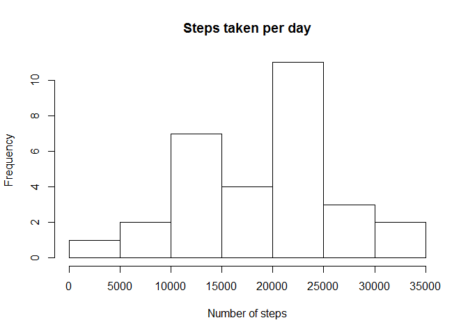
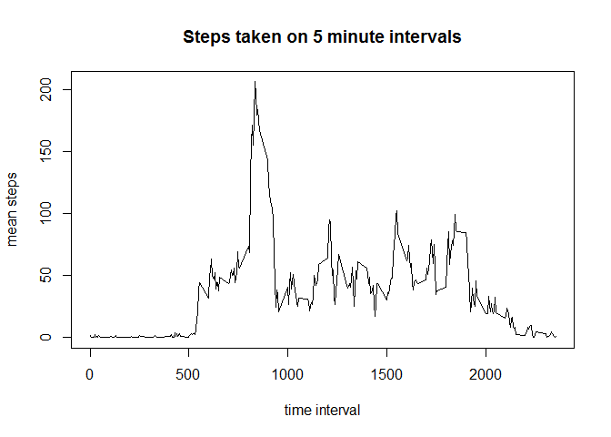
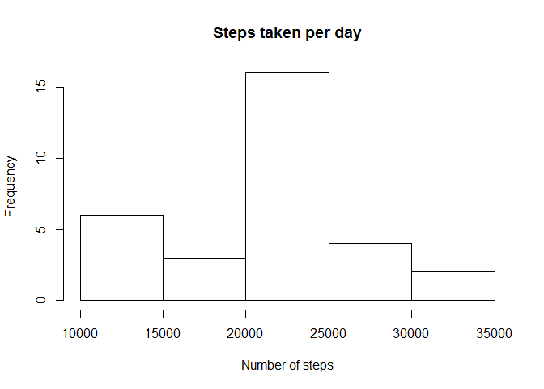
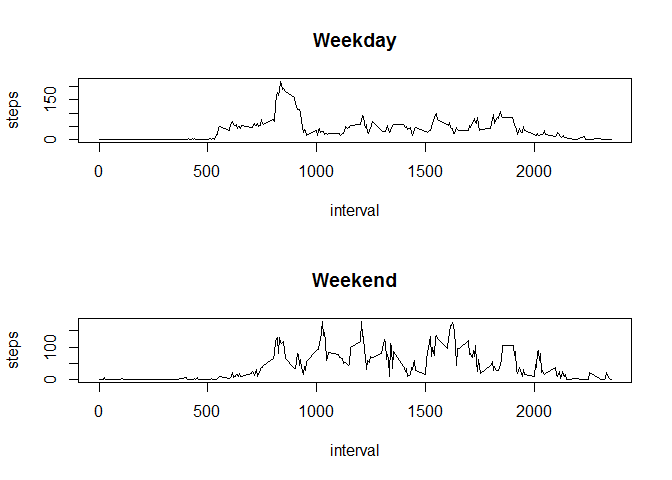

## Loading and preprocessing the data

We first load the required packages and read the dataset.


```r
library(dplyr)
```

```
## 
## Attaching package: 'dplyr'
```

```
## The following objects are masked from 'package:stats':
## 
##     filter, lag
```

```
## The following objects are masked from 'package:base':
## 
##     intersect, setdiff, setequal, union
```

```r
library(lubridate)
```

```
## 
## Attaching package: 'lubridate'
```

```
## The following object is masked from 'package:base':
## 
##     date
```

```r
data <- read.csv("activity.csv")
```
Dates are stored as character,so we need to transform them into date type and add the day to the dataset.


```r
dates <- as.Date(data$date)
data$date <- dates
datadate <- cbind(data,day=day(data$date))
```
There are several missing data, so we remove the missing observations and create a new complete dataset


```r
notNA <- !is.na(datadate$steps)
datadate2 <- datadate[notNA,]
```

## What is mean total number of steps taken per day?

We want to calculate the average number of steps taken each day, so we group observations by day and sum over each day.


```r
datasum <- summarise_all(group_by(datadate2,day),sum)
```

Now we have the appropiate data to do a histogram.


```r
hist(datasum$steps, main ="Steps taken per day" ,xlab = "Number of steps")
```

<!-- -->

We answer the first question calculating the mean and median total number daily steps.


```r
summary(datasum$steps)[3:4]
```

```
##   Median     Mean 
## 20597.50 19020.27
```

## What is the average daily activity pattern?

We are interested in plotting the average daily pattern, so we group by interval and average over all days. That is made by the following code.


```r
datamean <- summarise_all(group_by(datadate2,interval),mean)
```

We plote the mean daily time series.


```r
plot(x=datamean$interval,y=datamean$steps,type = "l",main = "Steps taken on 5 minute intervals", xlab ="time interval", ylab = "mean steps")
```

<!-- -->

We want to  know which time interval has the maximum actitivy pattern.


```r
datamean[which.max(datamean$steps),1]
```

```
## # A tibble: 1 x 1
##   interval
##      <int>
## 1      835
```

```r
max(datamean$steps)
```

```
## [1] 206.1698
```

## Imputing missing values

We want to complete the dataset filling in the missing values. Each missing value is imputed using the average number of steps for the correspondant time interval. We store the filled database in another dataframe.

```r
datafill <- datadate
for (i in 1:dim(datadate)[1]) {
  if (is.na(datadate$steps[i])) {
    inter <- data$interval[i]
    datafill$steps[i] <- datamean[datamean$interval==inter,][2]
  }  
}
datafill$steps <- as.numeric(datafill$steps)
```

We want to repeat the daily analysis (histogram, mean and median total daily steps).The histogram is similar, but the mean and median number of steps are slightly higher. 


```r
datafsum <- summarise_all(group_by(datafill,day),sum)
hist(datafsum$steps, main ="Steps taken per day" ,xlab = "Number of steps")
```

<!-- -->

```r
summary(datafsum$steps)[3:4]
```

```
##   Median     Mean 
## 21641.00 21185.08
```
 
## Are there differences in activity patterns between weekdays and weekends?

To conclude we vant to know if the daily pattern is different in weekdays or weekends. The first thing that we do is to create a factor variable that equals to TRUE if the day is saturnday or sunday. We store the result in another dataset.


```r
weekend <- (weekdays(datafill$date)=="sabado" | weekdays(datafill$date)=="domingo")
weekendf <- factor(weekend,labels = c("weekday","weekend"))
datafillw <- cbind(datafill,weekday=weekendf)
```

We split the dataframe in two separate datasets. One for weekdays and another one for weekends. The results are gruped by time interval and average over observed days of each class.


```r
datawend <- datafillw[datafillw$weekday =="weekend",]
datawday <- datafillw[datafillw$weekday =="weekday",]
meanwday <- summarise_all(group_by(datawday[,1:4],datawday$interval),mean)
meanwend <- summarise_all(group_by(datawend[,1:4],datawend$interval),mean)
```

To conclude we plot both time series. We can see that the steps taken in weekdays have a big single peak. In contrast, the activity pattern for weekends is distributed more uniformly.

```r
par(mfrow=c(2,1))
plot(x=meanwday$interval,y=meanwday$steps,type="l",main="Weekday",xlab = "interval", ylab="steps")
plot(x=meanwend$interval,y=meanwend$steps,type="l",main="Weekend",xlab = "interval", ylab="steps")
```

<!-- -->

